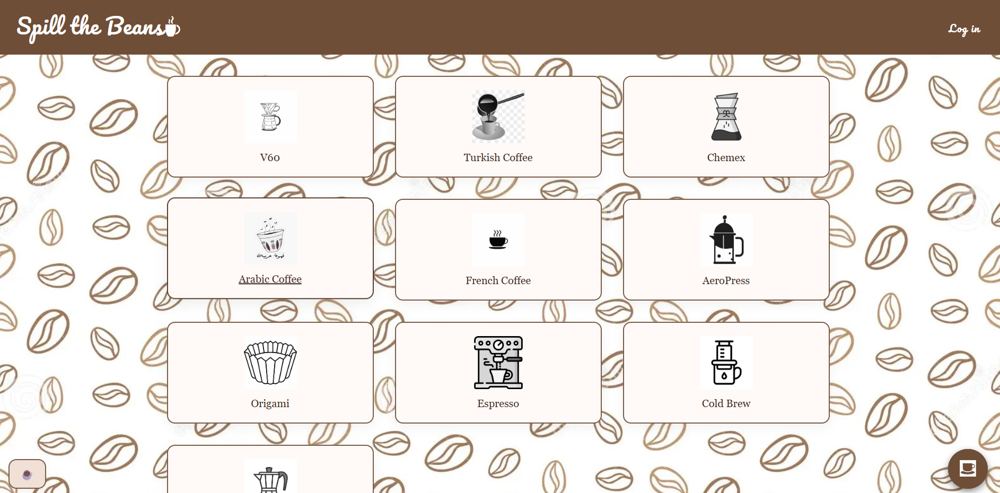
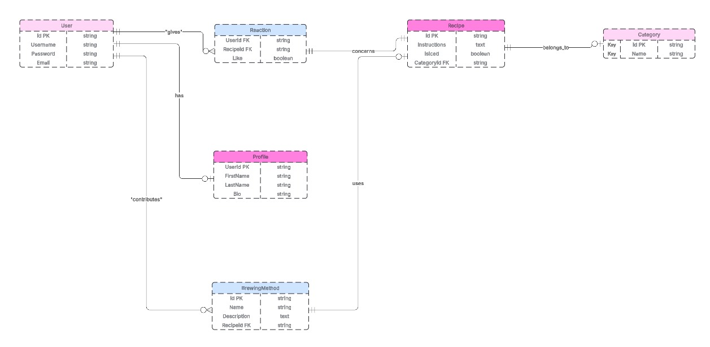

# ☕ Spill the Beans

## Description

**Spill the Beans** is a community-driven web application for coffee lovers to explore, share, and react to brewing recipes from around the world. Whether you're into V60, Turkish coffee, or Cold Brew, this platform lets users post their favorite brewing methods, engage with others through likes, and personalize their profiles. It's a digital café for discovering and celebrating global coffee culture.

---

## 📸 Screenshots

- 

---
## ERD
- 

---

## 🛠️ Technologies Used

- **Backend**: Django (Python), Django Templates
- **Database**: posterSQL

---

